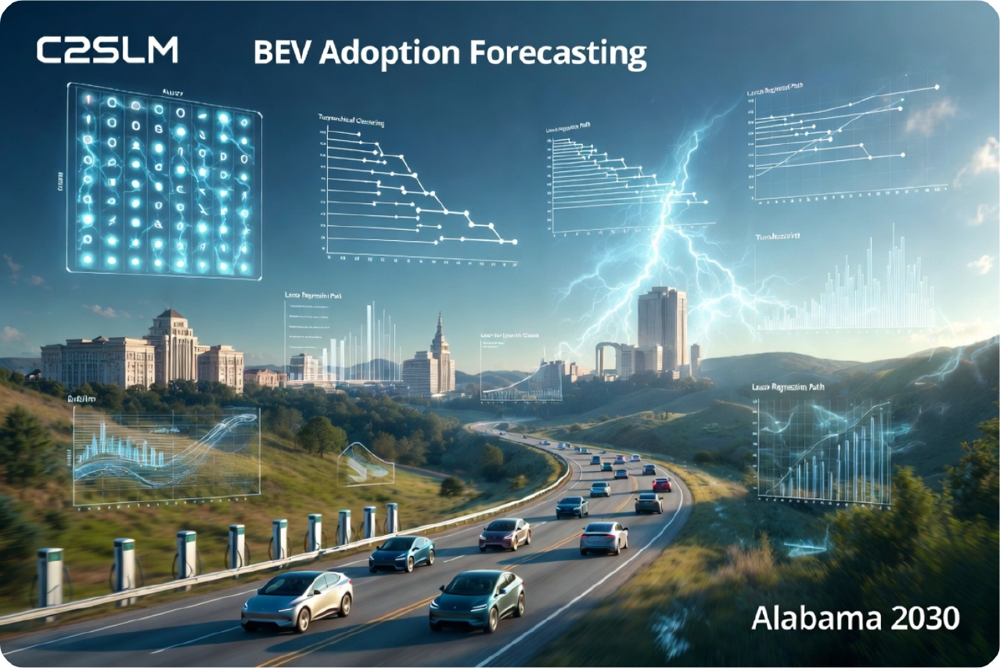
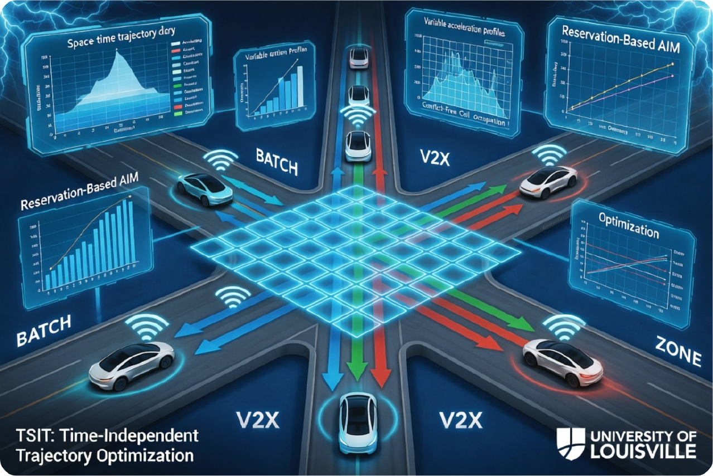
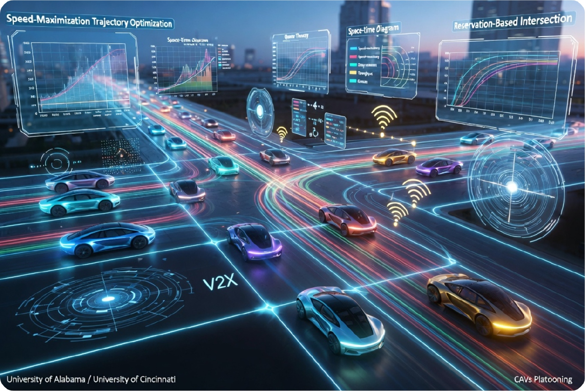
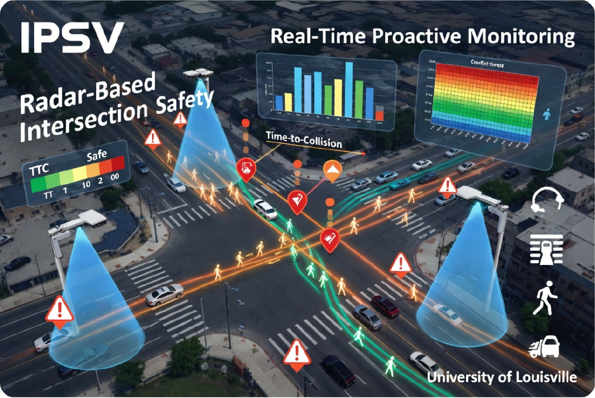
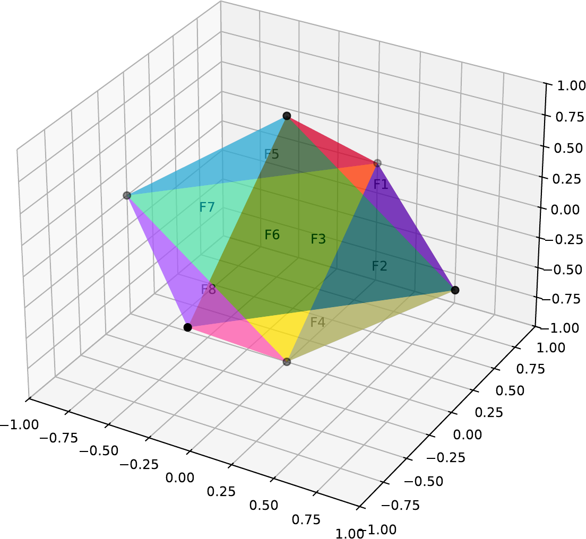
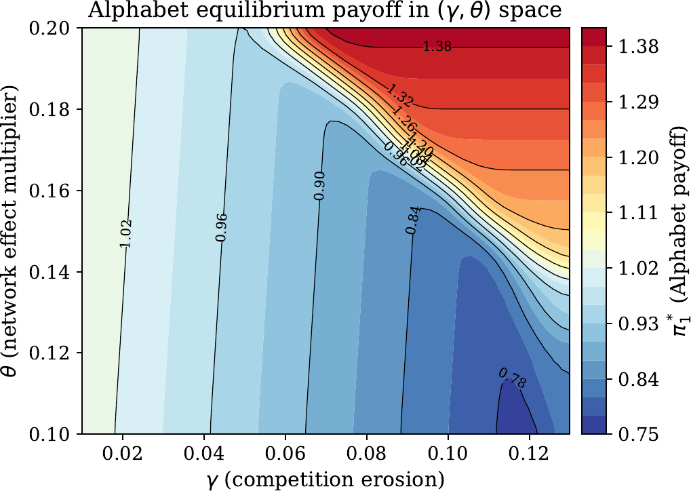
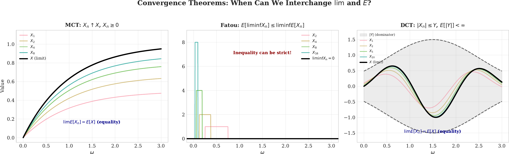
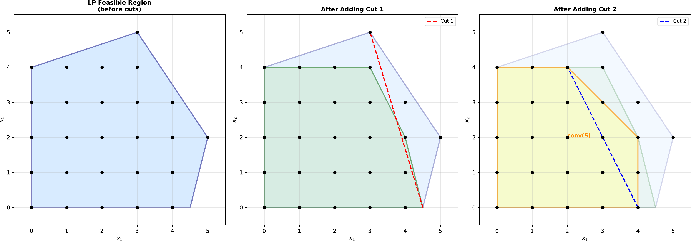
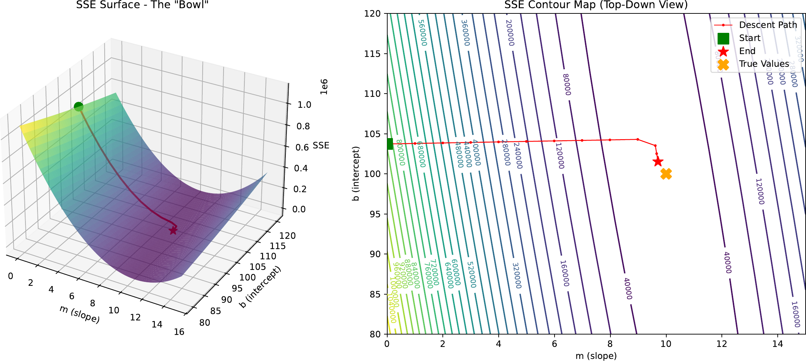

<h1 align="center">Muting (Don) Ma</h1>

  Ph.D. researcher in optimization, stochastic modeling, game theory, and predictive analytics with applications in <strong>Connected, Autonomous, Shared, and Electric (CASE)</strong> vehicle ecosystems
   
  Contact: <a href="mailto:muting.ma@outlook.com">muting.ma@outlook.com</a> | <a href="https://linkedin.com/in/mutingma">LinkedIn</a>
    
  <em><strong>I welcome any constructive comments, suggestions, and collaboration opportunities. Please feel free to reach out if you have any questions or would like to discuss potential research partnerships.</strong></em>
    
  

## Research Bio

<table>
  <tr>
    <td width="50%" valign="top">
      
      <strong>EV demand learning.</strong> I build sparse panel-learning and correlation-based clustering models to identify stable electric-vehicle adoption drivers and improve market forecasting.
    </td>
    <td width="50%" valign="top">
      
      <strong>Trajectory optimization.</strong> My doctoral work translates connected and autonomous vehicle intersection conflicts into reservation, scheduling, and trajectory decisions.
    </td>
  </tr>
  <tr>
    <td width="50%" valign="top">
      
      <strong>System efficiency.</strong> I connect local scheduling decisions with queue-theoretic objectives, mixed-integer models, and network-level traffic performance.
    </td>
    <td width="50%" valign="top">
      
      <strong>Monitoring and risk.</strong> I use sensor fusion, conflict detection, and visual analytics to convert raw mobility data into operational safety priorities.
    </td>
  </tr>
</table>

## Skill Map

<table>
  <tr>
    <td width="50%" valign="top">
      
      <strong>Deterministic optimization.</strong> Linear systems, polyhedral geometry, simplex search, duality, KKT conditions, and Farkas certificates support my optimization modeling work.
    </td>
    <td width="50%" valign="top">
      
      <strong>Strategic systems.</strong> Strategic-form, extensive-form, Bayesian, repeated, and auction games help me model coopetition, policy-sensitive adoption, and equilibrium incentives.
    </td>
  </tr>
  <tr>
    <td colspan="2" valign="top">
      
      <strong>Stochastic modeling and control.</strong> Probability spaces, convergence theorems, stochastic processes, queues, dynamic programming, and Markov decision processes shape my uncertainty analysis.
    </td>
  </tr>
  <tr>
    <td colspan="2" valign="top">
      
      <strong>Integer and combinatorial optimization.</strong> I work with formulation strength, integer hulls, relaxations, branching, branch-and-cut, decomposition, and dominance-pruned computation.
    </td>
  </tr>
  <tr>
    <td colspan="2" valign="top">
      
      <strong>AI and predictive modeling.</strong> Gradient descent, stochastic gradient descent, backpropagation, supervised learning, representation learning, cross validation, calibration, and error diagnosis guide my machine-learning implementation work.
    </td>
  </tr>
</table>