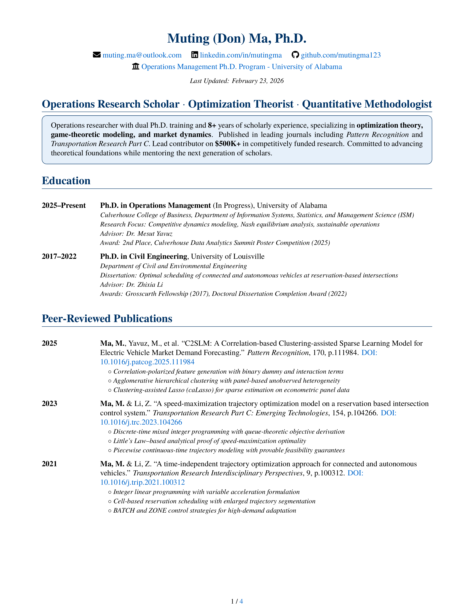
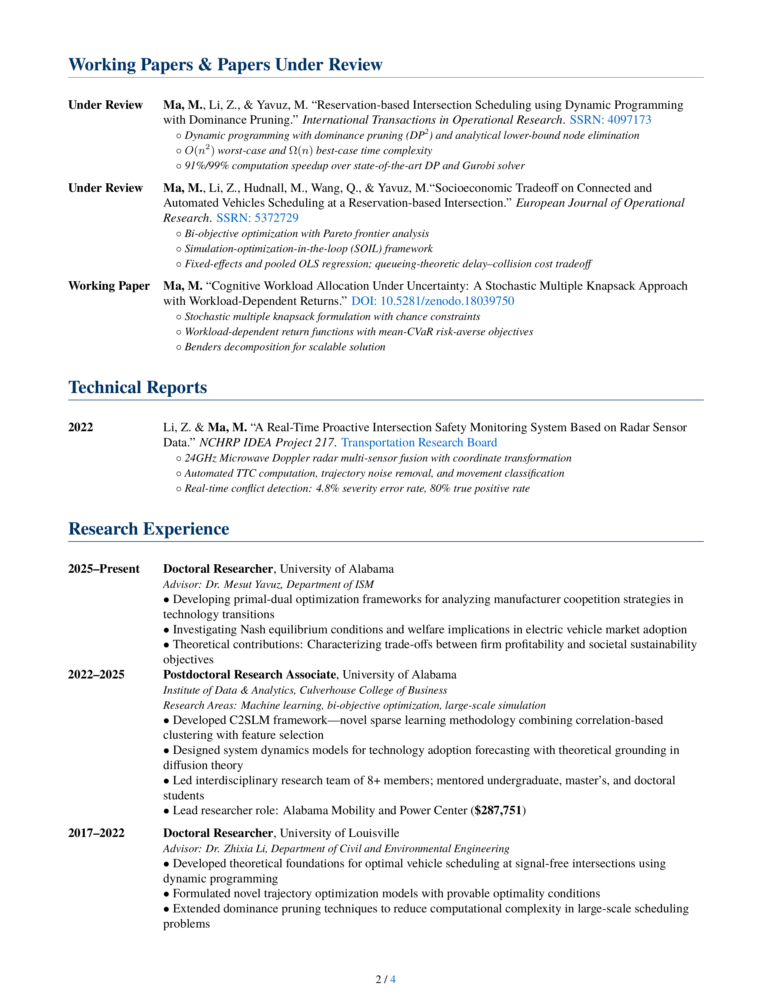
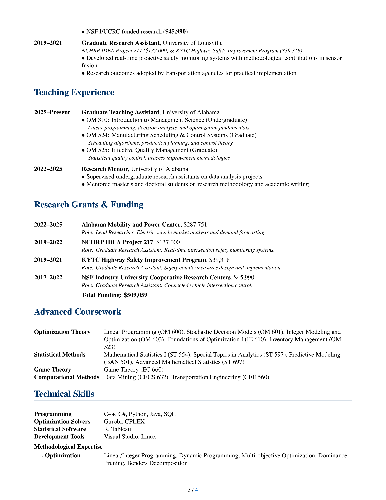
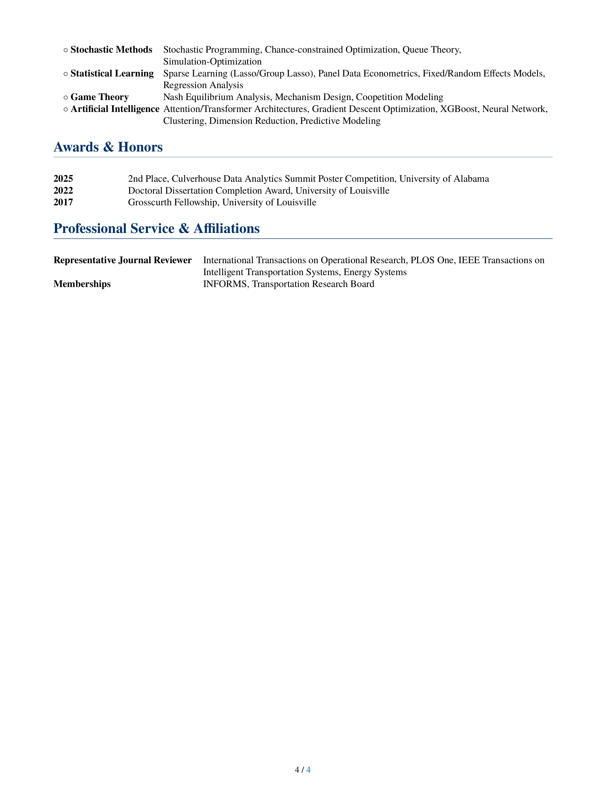

## Hi there 👋

- 🔭 I’m currently working on Ph.D. in Operations Management at University of Alabama, developing primal-dual optimization frameworks for manufacturer coopetition and Nash equilibrium analysis in EV market transitions.
- 🌱 I’m currently learning advanced optimization theory, game theory, and stochastic modeling.
- 👯 I’m looking to collaborate on research in operations research, predictive analytics, and sustainable technology transitions.
- 🤔 I’m looking for help with open discussions on multi-objective decision frameworks and market dynamics.
- 📫 How to reach me: mma10@ua.edu or [LinkedIn](https://linkedin.com/in/mutingma).
- 😄 Pronouns: He/Him
- ⚡ Fun fact: Achieved 20.1% improvement in EV market forecasting accuracy and optimized traffic for 14,400 vehicles/hour.

## CV

